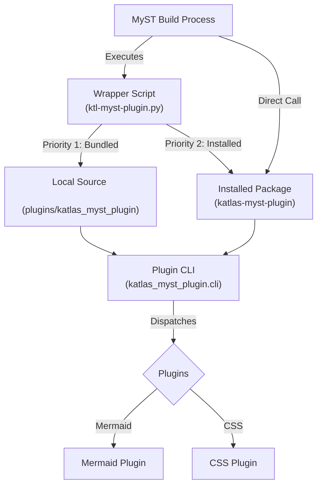

# Architecture & Design

The Katlas MyST Plugin ships **two runtime variants** of the same capabilities:

## Variant 1: JavaScript (in-process) — default for site builds

`packages/katlas-myst-plugin` implements the `ktl:mermaid` directive and the
`katlas-mermaid` document transform as a mystmd **javascript plugin**: mystmd
imports the built `dist/index.mjs` once and runs transforms in-process.

- **Why it is the default**: mystmd invokes *executable* plugins once per page
  transform, in parallel. On a 165-page project the python variant reached
  ~250 concurrent processes and >6GB RSS, hanging the build machine
  (2026-09-08). The javascript variant performs the identical transform with
  no measurable memory overhead.
- The bundle is self-contained (tsup with `noExternal`), so a single `.mjs`
  file can be copied into any documentation project and referenced by relative
  path — no `node_modules` required.
- Config discovery walks upward from the build directory to find
  `ktl-myst-plugin.yml`, so per-project builds inside a multi-project estate
  share one estate-root config.
- Deliberately **no network at build time**: the python variant fetched the
  mermaid config schema from mermaid.js.org for validation; the javascript
  variant delegates config validation to mermaid at render time.

## Variant 2: Python executable — PDF/typst pre-rendering only

The python package remains for export pipelines where diagrams must be
pre-rendered server-side and the per-invocation subprocess cost is bounded and
sequential. It follows the **"Thin Wrapper & Pluggable Core"** architecture
below. Its conda auto-management (`python.manage: auto`) is retired: every
parallel invocation ran `conda env list` / `conda env create` — use
`manage: manual` only.

## High-Level Overview (python variant)

1.  **Wrapper Layer (`wrappers/`)**: Lightweight scripts that act as the entry point for the MyST build process. Their primary job is to bootstrap the environment.
2.  **Core Package (`python/katlas-myst-plugin/`)**: The actual Python package containing the logic.
    *   **CLI**: Central dispatcher.
    *   **Core**: Shared utilities (Config, Environment).
    *   **Plugins**: Feature implementations (Mermaid, etc.).

## detailed Components

### 1. Thin Wrappers
Located in `wrappers/`, these scripts (e.g., `ktl-myst-plugin.py`) are minimal. They:
-   **Auto-detect Source**: Prioritize a local `plugins/katlas_myst_plugin` directory if it exists (Bundled Mode).
-   **Fallback to Installed**: Attempt to import the package from the current Python environment.
-   **Zero-Overhead**: No mandatory environment switching, keeping build times fast.
-   **Error Handling**: Provide clear instructions if dependencies (`pyyaml`, `jsonschema`) are missing.

### 2. Core Package
Located in `python/katlas-myst-plugin/src/katlas_myst_plugin/`.

-   **`cli.py`**: The main entry point. It parses arguments (e.g., `--transform`, `--directive`) and dispatches control to the appropriate plugin module.
-   **`core/config.py`**: Handles loading and merging of configuration from `ktl-myst-plugin.yml`.
-   **`core/environment.py`**: Contains logic to check, create, and manage Conda environments automatically.

### 3. Plugin Modules
Located in `src/katlas_myst_plugin/plugins/`. Each feature (like Mermaid) is encapsulated here.

-   **`mermaid/main.py`**: Handles identifying `mermaid` nodes, merging configuration (Local > World > Default), and transforming them into HTML/SVG.
-   **`css/main.py`**: Injects necessary CSS assets.

## Extending the Plugin

To add a new feature (e.g., a "Graphviz" plugin):

1.  **Create a new module**: `src/katlas_myst_plugin/plugins/graphviz/main.py`.
2.  **Implement the logic**: Create a function that accepts data and config, and returns the transformed node.
3.  **Register in CLI**: Update `cli.py` to:
    -   Add a new argument or directive handler (e.g., `--transform katlas-graphviz`).
    -   Dispatch to your new function.
4.  **Update `PLUGIN_SPEC`**: Add your new directive or transform to the `PLUGIN_SPEC` dictionary in `cli.py` so MyST knows about it.
