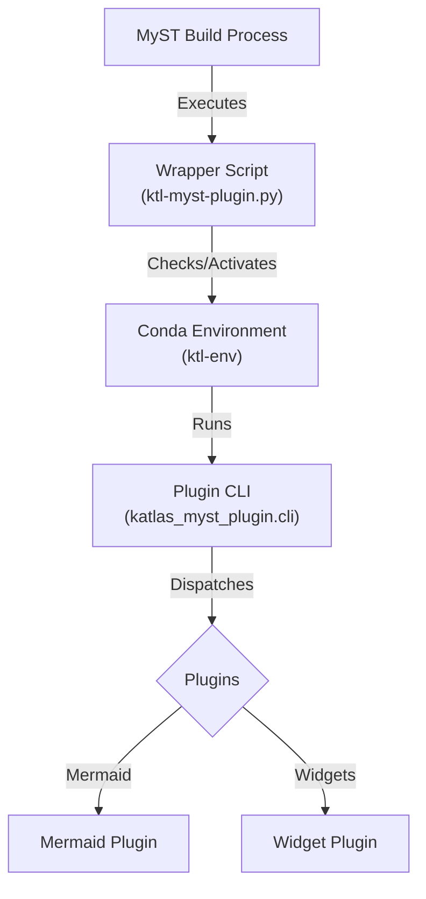

# Architecture & Design

The Katlas MyST Plugin follows a **"Thin Wrapper & Pluggable Core"** architecture designed for extensibility, ease of use, and robust environment management.

## High-Level Overview

1.  **Wrapper Layer (`wrappers/`)**: Lightweight scripts that act as the entry point for the MyST build process. Their primary job is to bootstrap the environment.
2.  **Core Package (`python/katlas-myst-plugin/`)**: The actual Python package containing the logic.
    *   **CLI**: Central dispatcher.
    *   **Core**: Shared utilities (Config, Environment).
    *   **Plugins**: Feature implementations (Mermaid, etc.).

## detailed Components

### 1. Thin Wrappers
Located in `wrappers/`, these scripts (e.g., `ktl-myst-plugin.py`) are minimal. They:
-   Check if the correct Conda environment (`ktl-env`) is active.
-   If not, they verify if the `katlas-myst-plugin` package is installed.
-   They delegate execution to the `katlas_myst_plugin.cli` entry point.

### 2. Core Package
Located in `python/katlas-myst-plugin/src/katlas_myst_plugin/`.

-   **`cli.py`**: The main entry point. It parses arguments (e.g., `--transform`, `--directive`) and dispatches control to the appropriate plugin module.
-   **`core/config.py`**: Handles loading and merging of configuration from `ktl-myst-plugin.yml`.
-   **`core/environment.py`**: Contains logic to check, create, and manage Conda environments automatically.

### 3. Plugin Modules
Located in `src/katlas_myst_plugin/plugins/`. Each feature (like Mermaid) is encapsulated here.

-   **`mermaid/main.py`**: Handles identifying `mermaid` nodes, merging configuration (Local > World > Default), and transforming them into HTML/SVG.
-   **`css/main.py`**: Injects necessary CSS assets.

## Extending the Plugin

To add a new feature (e.g., a "Graphviz" plugin):

1.  **Create a new module**: `src/katlas_myst_plugin/plugins/graphviz/main.py`.
2.  **Implement the logic**: Create a function that accepts data and config, and returns the transformed node.
3.  **Register in CLI**: Update `cli.py` to:
    -   Add a new argument or directive handler (e.g., `--transform katlas-graphviz`).
    -   Dispatch to your new function.
4.  **Update `PLUGIN_SPEC`**: Add your new directive or transform to the `PLUGIN_SPEC` dictionary in `cli.py` so MyST knows about it.
