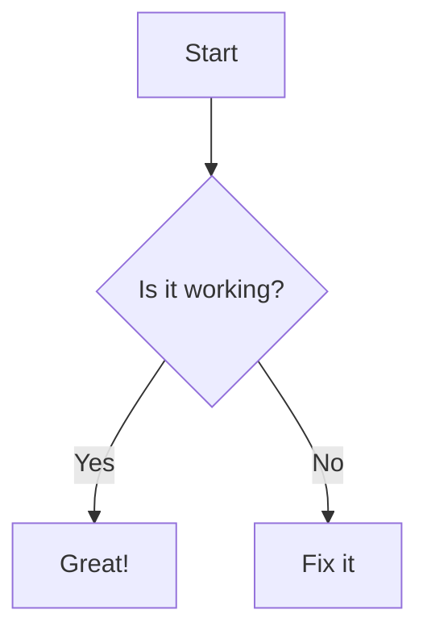
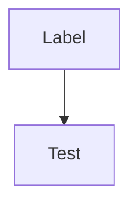

# Test Page

This is a test page to verify plugin loading.

# Sample Diagram

# Diagram with Inline Config

(my-labeled-diagram)=

# Alias Support
:::{ktl:mermaid}
graph TD
    Alias --> Support
:::

# Python Directive Support

:::{ktl:mermaid}
graph TD
    Py[Python Directive] --> Works[Yes!]
:::

